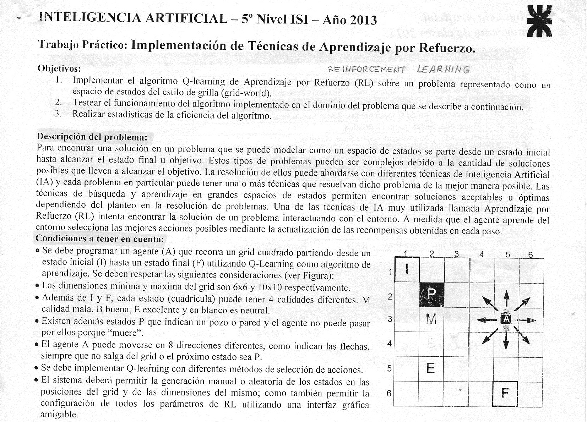

# Inteligencia Artificial 2013

## Implementación de Técnicas de Aprendizaje por Refuerzo

### Autores
* Levin, Fabián Andrés
* Seba, Sebastián José
* Vallejos, Lucía Belén

### Profesores
* Dr. Gramajo, Sergio
* Dr. Karanik, Marcelo

## Escenario

## Resultados
Ver paper [`Implementación de Técnicas de Aprendizaje por Refuerzo`](/paper/Seba%2C%20Vallejos%2C%20Levin%20-%20Implementaci%C3%B3n%20de%20T%C3%A9cnicas%20de%20Aprendizaje%20por%20Refuerzo.pdf "Seba, Vallejos, Levin - Implementación de Técnicas de Aprendizaje por Refuerzo [PDF]") [PDF].
